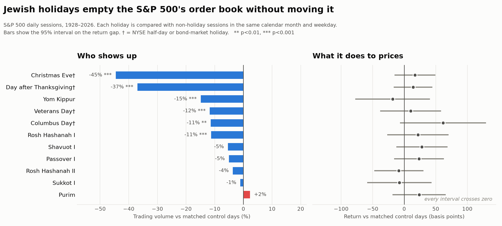

# Trading on holidays the stock market stays open for

**S&P 500, 1928–2026 (24,797 sessions). Volume tests use 1950–2026 (19,300 sessions).**

## The short answer

There is **no tradable return edge** on Jewish holidays. Thirty-two holidays were
tested against control days matched on calendar month and weekday; **none survives
a correction for multiple testing.** Four cleared a raw p < 0.05, where 1.6 are
expected by chance alone.

What *is* real — and large, and highly significant — is that **fewer people trade.**
Volume on Yom Kippur runs **14.9% below** matched control days (p < 0.0001), and on
the first day of Rosh Hashanah **11.2% below** (p = 0.0006). Both survive correction
comfortably. Every other Jewish holiday is indistinguishable from an ordinary day on
both counts.

So the honest framing is: **this is an execution fact, not an alpha signal.** The
market gets measurably thinner on the two High Holy Days, but it does not drift.

## How big is a 15% attendance drop?

Large enough to match days the market treats as official holidays:

| Day | Volume vs matched control | FDR p |
|---|---|---|
| Christmas Eve † | −45.0% | <0.0001 |
| Day after Thanksgiving † | −37.0% | <0.0001 |
| **Yom Kippur** | **−14.9%** | **<0.0001** |
| Columbus Day † | −13.6% | 0.0006 |
| Veterans Day † | −11.7% | <0.0001 |
| **Rosh Hashanah I** | **−11.2%** | **0.0096** |
| St. Patrick's Day | +6.2% | 0.062 |
| Halloween | +1.5% | 0.750 |
| Tax Day | +1.2% | 0.750 |
| Cinco de Mayo | +0.1% | 0.957 |

† NYSE closes early, or the bond market is shut. Christmas Eve and the day after
Thanksgiving are 1pm closes, so their drop is largely mechanical.

Yom Kippur is the striking one. It is an ordinary full session on the exchange
calendar, yet **more people stay away than on Columbus Day or Veterans Day**, when
the bond market is formally closed. No exchange rule produces that — it is purely
who chose not to come in.

The gradient across the Jewish calendar tracks observance, not the calendar's formal
severity. Yom Kippur and the first day of Rosh Hashanah, the two days observed even
by otherwise secular Jews, show the whole effect. Shavuot I (−5.4%) and Passover I
(−5.1%) are directionally similar but not significant. The intermediate days of
Passover and Sukkot, when work is permitted, show nothing (−0.7%, p = 0.50), and
neither do the minor holidays where work is permitted, Purim among them (+0.7% as a group).

## Returns: nothing, in any era

| Group | n | Return vs control | p |
|---|---|---|---|
| Yom tov (work forbidden) | 865 | −0.2 bp | 0.97 |
| Erev (day before a festival) | 332 | +13.1 bp | 0.067 |
| Chol hamoed (intermediate days) | 591 | +1.6 bp | 0.79 |
| Minor holidays (work permitted) | 330 | −3.9 bp | 0.52 |

The pooled yom tov estimate is *negative two hundredths of a basis point*. That is as
close to a clean zero as this kind of study produces.

Split by era, it stays zero:

| | 1928–69 | 1970–89 | 1990–2009 | 2010–26 |
|---|---|---|---|---|
| Yom tov return | +2.3 bp | −3.9 bp | −4.1 bp | +1.8 bp |
| High Holy Day return | −1.9 bp | +22.5 bp | −4.3 bp | −6.0 bp |
| **High Holy Day volume** | **−10.3%** | **−22.5%** | **−12.2%** | **−6.3%** |

Volume is significant in all four eras (p = 0.050, 0.0002, 0.0005, 0.0048). Returns
are significant in none of them (p = 0.93, 0.40, 0.86, 0.75). Attendance has a
century-long signature; price does not.

The volume effect has roughly halved since 2000. That is what you would expect as
execution moved from people to machines: an algorithm does not observe Yom Kippur.
It has not gone to zero, which says a meaningful share of volume still traces back
to someone deciding to come to work.

## "Sell Rosh Hashanah, buy Yom Kippur"

The old floor adage, tested on all 99 windows from 1928 to 2026 — short at the close
before Rosh Hashanah, cover at the Yom Kippur close (a 7-session window on average):

- Mean return over the window: **−0.53%** (the short side wins on average)
- Median: −0.31%
- Years the market fell: **52.5%** — 52 of 99
- **t = −1.28, p = 0.21**

The direction matches the adage, and the magnitude is not trivial next to a +0.22%
typical 7-session return. But it is not statistically distinguishable from a coin
flip, and it is concentrated in eras nobody can trade any more:

| Era | Mean window return | Years down |
|---|---|---|
| 1928–49 | −1.50% | 59% |
| 1950–69 | −0.12% | 45% |
| 1970–89 | +0.31% | 45% |
| 1990–2009 | −1.25% | 70% |
| **2010–26** | **+0.04%** | **44%** |

Over the last sixteen years the trade has made nothing and the market has risen in
most of those windows. The adage's pre-war leg is doing most of the work, and the
pre-war S&P is a backfilled index nobody was trading.

The companion leg — buy Yom Kippur, sell Passover — returns +5.3% and is positive in
68% of years. That sounds impressive until you notice it is a six-month long position
in the stock market, which is what the stock market does anyway.

## The one holiday effect that was real — and died

The classic **pre-holiday effect** (the session before an exchange closure) is the
cautionary tale. Measured the same way, across 941 pre-closure sessions:

| Era | Return vs control | p |
|---|---|---|
| 1928–69 | **+39.0 bp** | <0.0001 |
| 1970–89 | **+23.5 bp** | 0.0010 |
| 1990–2009 | +4.4 bp | 0.60 |
| 2010–26 | +6.3 bp | 0.46 |

It was genuinely there, it was big, and it was documented in the academic literature
in the late 1980s — after which it promptly collapsed to nothing. Whatever it was, it
does not survive being known about. Any Jewish-holiday strategy built on this data
would be reaching for something far weaker than an effect that already died.

## Why the naive version of this study gives wrong answers

Two confounds are structural, not incidental, and both inflate a careless estimate:

**Seasonality.** The Tishrei holidays — Rosh Hashanah, Yom Kippur, Sukkot — always
fall in September or October. September is historically the weakest month of the
year. Compare Yom Kippur against "all other days" and you inherit that drift before
a single holiday effect is considered.

**Weekday.** The Hebrew calendar's postponement rules (*dechiyot*) forbid Rosh
Hashanah from falling on Sunday, Wednesday or Friday. In the sample, **Yom Kippur
only ever falls on Monday, Wednesday or Thursday**, and Rosh Hashanah I only on
Monday, Tuesday or Thursday. The weekday composition of the holiday sample is
permanently skewed against the market as a whole.

Every test here therefore draws its controls from non-holiday sessions in the **same
calendar month and the same weekday, in other years**, and builds the null by
redrawing 20,000 times. Control days are never themselves any other kind of holiday.

The value of this shows up in Columbus Day, which looks like the best result in the
secular set: +64 bp versus control, p = 0.010. It is an artifact. The control pool —
October Mondays — contains 19 October 1987 (−20.5%), 28 October 1929 (−12.9%) and
three more crash Mondays. Compare medians instead and the gap shrinks from 64 bp to
15 bp (+12.6 vs −2.7). The "effect" is five days in October, not Columbus Day.

## What the data cannot tell you

**This study is underpowered for anything small.** With 68 Yom Kippurs and a daily
standard deviation of 119 bp, the smallest effect detectable at 80% power is
**40 bp/day**:

| Sample | n | Min. detectable effect |
|---|---|---|
| Yom Kippur only | 68 | 40.4 bp/day |
| High Holy Days | 137 | 28.5 bp/day |
| All yom tov | 865 | 11.3 bp/day |
| All Jewish holidays | 2,118 | 7.2 bp/day |

So "no effect" means **"no effect large enough to trade"** — not "exactly zero." A
3 bp holiday drift could exist and be permanently invisible here.

This is the fundamental constraint on annual-calendar research: a once-a-year signal
accumulates one observation per year. Even the largest raw estimate in the whole
study (Erev Passover, +31 bp) would need roughly **116 years** of observations to reach t = 2 — and it has had 64.
Nobody gets to run that experiment, which is why calendar anomalies are so reliably
discovered and so reliably fail to replicate.

Other limits worth stating: the S&P 500 index before 1957 is a backfilled
reconstruction; volume is NYSE composite volume attached to the index, available only
from 1950; returns are index price returns and exclude dividends; and the analysis
uses Diaspora holiday observance, which is the right convention for New York.

## The practical takeaway

If you trade, the usable conclusion is about **execution, not direction**. On Yom
Kippur and the first day of Rosh Hashanah, expect a book roughly 10–15% thinner than
a comparable session, with intraday range about 5% narrower (p = 0.054). Thinner
books mean worse fills on size and more slippage on market orders. Treat those two
days the way you would treat Columbus Day: a full session on paper, a half-staffed
one in practice.

What you should not do is take a position because of the date. The century of data
says that trade has no edge, the adage that claims otherwise is a coin flip that
stopped working in 2010, and the one holiday effect that was genuinely there
disappeared the moment it was published.
